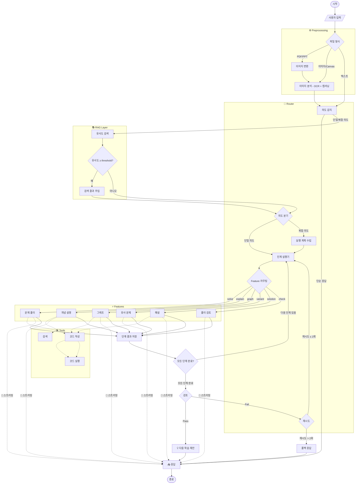

# Proovy AI Agent

이공계 대학생을 위한 AI 튜터 서비스 **Proovy**의 핵심 두뇌 역할을 하는 AI 에이전트 서버입니다.

## 기술 스택

- **Language:** Python 3.11
- **Framework:** FastAPI
- **Orchestration:** LangGraph, LangChain
- **Vector Database:** PostgreSQL (pgvector)
- **Monitoring:** Langfuse
- **Tools:** E2B Code Interpreter
- **Package Manager:** uv

## 주요 기능

### 1. 지능형 문제 분석 (Preprocessing)

- **Vision OCR:** 이미지 형태의 문제를 텍스트 및 수식으로 변환합니다.
- **이미지 처리:** PDF 및 이미지 파일에서 문제를 추출하고 전처리를 수행합니다.

### 2. RAG 영역

- **Semantic Search:** pgvector를 활용하여 관련 자료에서 관련 개념을 검색합니다.
- **Context-Aware:** 검색된 지식을 바탕으로 환각 현상을 최소화한 답변을 생성합니다.

### 3. 멀티 에이전트 워크플로우 (Subgraphs)

- **Explain:** 복잡한 이공계 개념을 상세히 설명합니다.
- **Solve:** 문제 풀이 과정을 논리적으로 전개하며 최적의 해법을 제시합니다.
- **Solution:** LaTeX 수식과 차트가 포함된 고품질 해설지 PDF를 생성합니다.

### 4. 코드 인터프리터 (E2B)

- 모든 응답에 대해 Python 코드를 작성하고 실행하여 정확한 결과를 도출합니다.

## 시스템 아키텍처

Proovy AI 에이전트는 LangGraph를 사용하여 복잡한 워크플로우를 상태 기반으로 관리합니다.



## 상세 프로젝트 구조

```text
Proovy-ai/
├── src/
│   ├── agents/
│   │   ├── prompts/
│   │   ├── tools/                # 에이전트 사용 도구 (e2b_runner 등)
│   │   ├── workflows/
│   │   │   ├── subgraphs/        # 단계별 서브그래프
│   │   │   │   ├── step1_preprocessing/ # 전처리 및 비전 분석
│   │   │   │   ├── step2_router/        # 라우팅 영역
│   │   │   │   ├── step3_rag/           # RAG 검색 로직 구현
│   │   │   │   └── step4_features/      # 세부 기능(Solve, Explain 등)
│   │   │   ├── final_response.py # 최종 응답 구성
│   │   │   ├── maingraph.py      # 메인 그래프 정의
│   │   │   ├── problem_utils.py
│   │   │   └── review_logic.py   # 답변 Review 로직
│   │   ├── agents.py
│   │   └── state.py              # LangGraph State 정의
│   ├── client/                   # 외부 서비스 통신 클라이언트
│   ├── core/
│   ├── memory/
│   ├── rag/                      # RAG 엔진 및 벡터 DB 연동
│   │   ├── vector_store/
│   │   ├── debug_similarity.py
│   │   ├── embeddings.py
│   │   └── retriever.py
│   │
│   ├── schema/
│   └── service/                  # FastAPI 서비스 엔드포인트
│       ├── credit_service.py
│       └── service.py
├── tests/                        # 테스트 코드 모음
│   ├── agents/
│   └── rag/
├── Dockerfile                    # 컨테이너 배포 설정
├── langgraph.json                # LangGraph Studio 설정
├── pyproject.toml                # uv 패키지 관리 설정
├── README.md
└── uv.lock
```

### PDF 생성 엔진 (E2B)

해설 PDF 생성 기능은 [E2B Code Interpreter](https://e2b.dev/) 보안 샌드박스 내에서 동적으로 Python 코드를 실행하여 처리됩니다.

### 워크플로우 시각화 (LangGraph Studio)

에이전트의 복잡한 상태 변화와 노드 간의 이동을 시각적으로 모니터링하고 테스트하려면 [LangGraph Studio](https://github.com/langchain-ai/langgraph-studio)를 사용합니다.

## 브랜치 전략

- `main`: 프로덕션 배포
- `dev`: 개발 통합
- `feat/{이슈번호}`: 기능 개발
- `fix/{이슈번호}`: 버그 수정

## 커밋 컨벤션

```
feat: 기능 추가
fix: 버그 수정
refactor: 리팩토링
docs: 문서 수정
chore: 설정 변경
```
